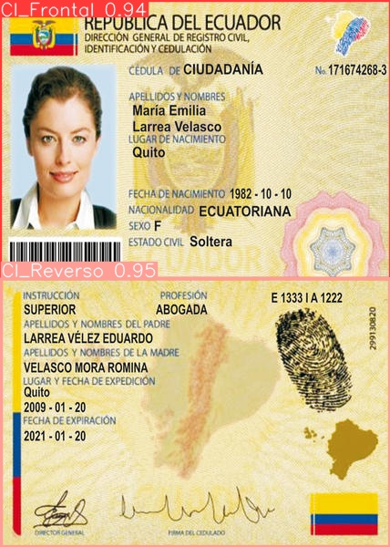
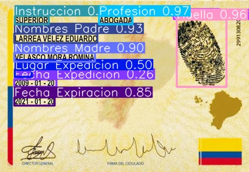
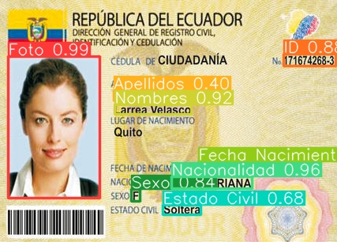
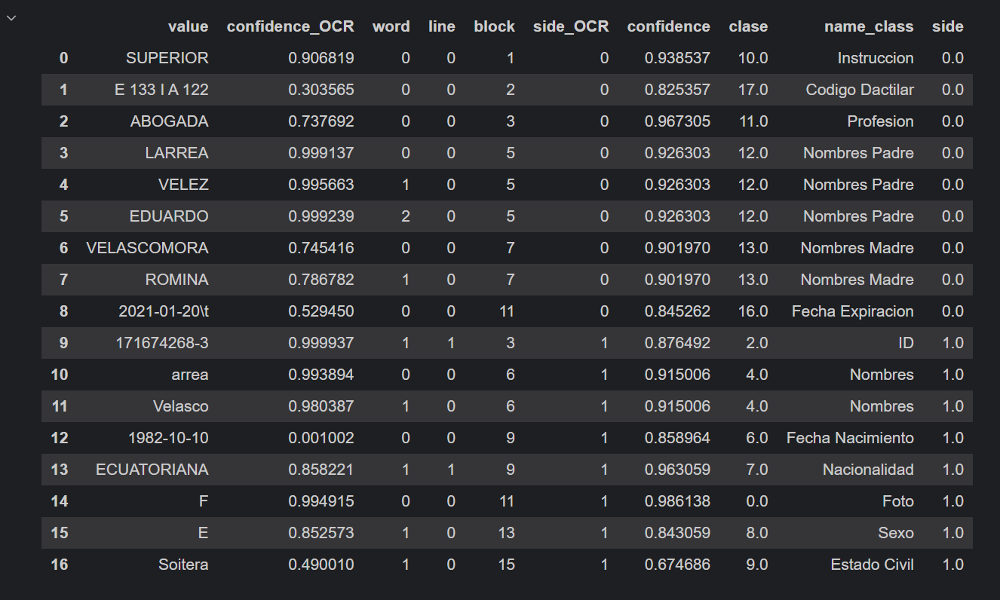

## Descripción del Repositorio

Este proyecto se centra en la extracción estructurada de información de cédulas de identidad ecuatorianas mediante el uso del algoritmo YOLO v8, reconocido como el estándar actual y state of the art en detección de objetos mediante redes neuronales convolucionales (CNN), junto con la biblioteca docTR para el reconocimiento óptico de caracteres (OCR). En su fase inicial de desarrollo, el modelo ha sido entrenado y optimizado utilizando un conjunto diverso de 150 imágenes de cédulas ecuatorianas.

### Proceso Técnico

1. **Detección de Regiones:** Utiliza YOLO v8 para identificar la región que contiene la parte frontal o trasera de la cédula de identidad en una imagen.
   
2. **Recorte de Regiones:** Se segmenta y recorta la región detectada de la imagen original para aislar las áreas relevantes de la cédula.
   
3. **Reconocimiento Óptico de Caracteres (OCR):** Aplica la biblioteca docTR para realizar OCR en las imágenes recortadas, extrayendo datos textuales como nombres, números de identificación, y fechas de nacimiento.
   
4. **Extracción de Información Estructurada:** Convierte los datos extraídos en un formato estructurado, facilitando su integración y análisis en sistemas de verificación de identidad y gestión de datos.

### Ejemplo practico desarrollado
Este ejemplo fue desarrollado con una cedula generica ficticia, puesto que se busca no exponer los datos de una persona real, pero el comportamiento del modelo es exactamente el mismo, dando resultados muy buenos en la deteccion de regiones. En el apartado del OCR se esta estudiando la posibilidad de incrementar un proceso de entrenamiento a un modelo preentrenado para buscar aumentar la fiabilidad de este apartado.

A acontinuacion se indica la imagen original enviada al modelo sobre el cual se encuentran las regiones de interes detectadas

Una vez detectada dichas regiones se procede a un recorte de las mismas y a ser procesadas por el modelo encargado de identidicar las regiones de los campos donde se encuentra la informaacion de los campos a ser extraidos 

De este ejemplo se obtuvieron los siguietes resultado, en el cual se puede observar los valores extraidos de cada uno de los campos, conjuntamente con las clase a la cual pertenecen y los valores de confianza del proceso.

### Aplicaciones Empresariales Potenciales

Este proyecto tiene aplicaciones significativas en diversos ámbitos empresariales:

- **Sector Financiero:** Automatización de la verificación de identidad para apertura de cuentas bancarias y procesos de crédito.
  
- **Gobierno y Servicios Públicos:** Optimización de registros civiles y gestión de identidad para servicios gubernamentales.
  
- **Servicios de Seguridad:** Verificación automatizada de identidad en sistemas de seguridad y control de acceso.
  
- **Sector Educativo:** Gestión automatizada de registros estudiantiles y control de acceso en instituciones educativas.

Este repositorio proporciona una solución robusta y escalable para la extracción y procesamiento automatizado de información de cédulas de identidad ecuatorianas, aprovechando tecnologías de vanguardia para mejorar la precisión y eficiencia en aplicaciones empresariales y de servicio público. ¡Se invita a la comunidad a contribuir y mejorar este proyecto!
